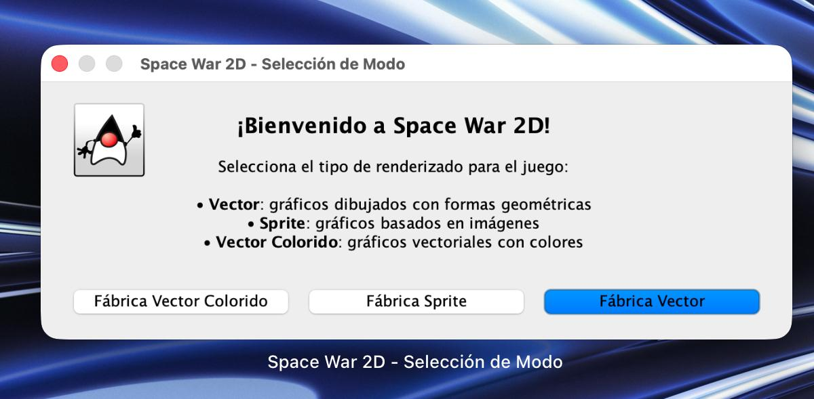
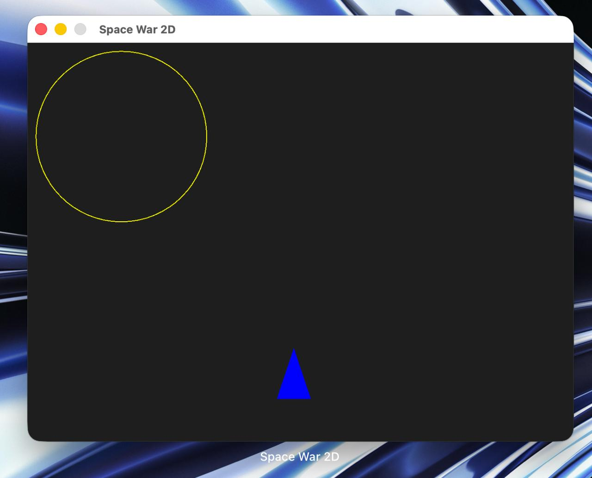
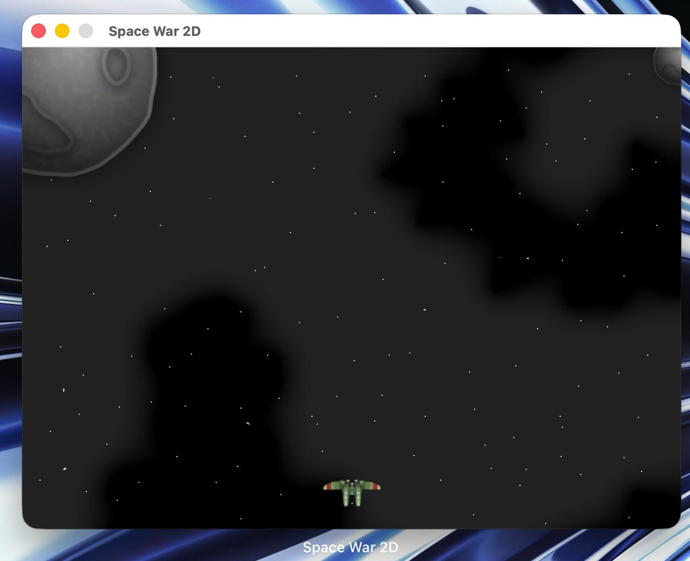
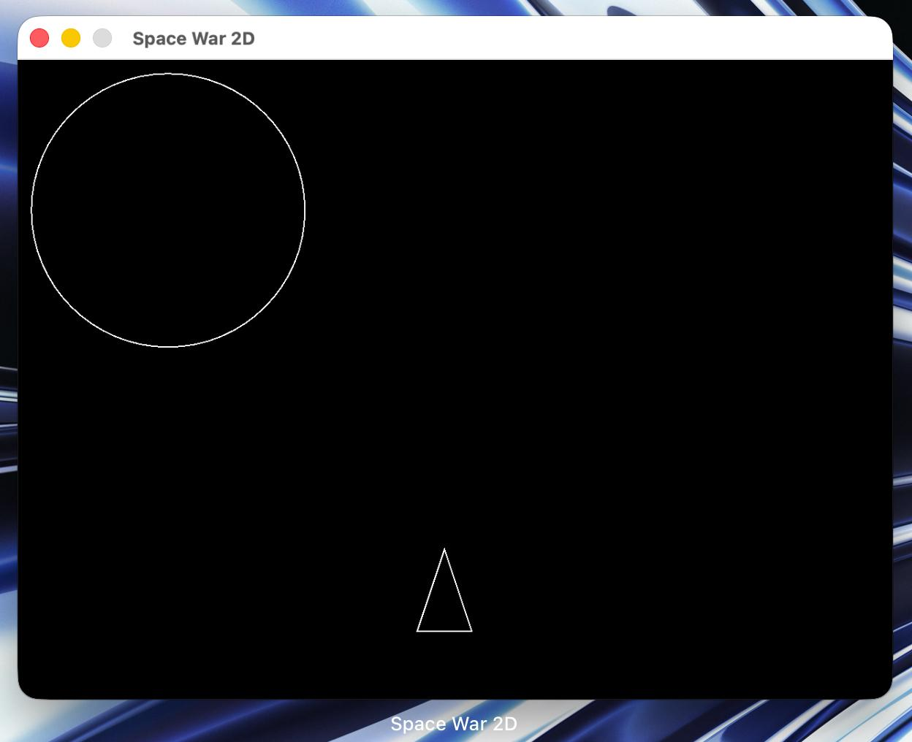

# Hecho por Daniel Riveros y Manuel Castillo

# Space War – Refactorización con Patrón Abstract Factory

## Descripción

Este proyecto corresponde a la refactorización del juego original entregado en clase.  
El objetivo fue aplicar un patrón creacional para mejorar la arquitectura del sistema y desacoplar la lógica del juego de la forma en que se renderizan sus elementos gráficos.

El juego ahora permite seleccionar diferentes estilos visuales sin modificar la lógica principal.

---

# Arquitectura del Proyecto

## Patrón Implementado: Abstract Factory

Se implementó el patrón **Fábrica Abstracta (Abstract Factory)** para separar:

- La lógica del juego (movimiento, disparos, colisiones).
- La forma en que se renderizan el jugador, la bala y el fondo.

La clase `Juego` no conoce implementaciones concretas, únicamente trabaja con interfaces.  
Esto permite cambiar completamente el estilo visual sin modificar el código principal.

---

## Estructura General

### Interfaces

- `RenderJugador`
- `RenderBala`
- `RenderFondo`
- `FabricaRender`

Estas interfaces definen los métodos necesarios para renderizar los elementos del juego.

---

### Fábricas Concretas

Se implementaron tres fábricas:

- `FabricaVectorColorido`
- `FabricaSprite`
- `FabricaVector`

Cada fábrica crea su propia versión del jugador, la bala y el fondo, asegurando coherencia visual en cada modo.

---

### Implementaciones

Cada fábrica retorna implementaciones específicas:

- **Modo Vector Colorido:**  
  Figuras geométricas básicas con colores.

- **Modo Sprite:**  
  Usa las imágenes originales (`bg.png` y `sprites.png`).

- **Modo Vector Blanco y Negro:**  
  Mismas figuras geométricas pero sin colores.

---

# Cómo Ejecutar el Juego

1. Ejecutar el archivo:
```
Juego.java
```

2. Si aparece una ventana de advertencia de seguridad, hacer clic en **Continuar**.


3. Al iniciar el programa aparecerá un `JOptionPane` que permite seleccionar el tipo de renderizado.



---

# Modos de Juego

## Fábrica Vector Colorido

Renderiza el juego utilizando figuras geométricas básicas con colores.



---

## Fábrica Sprite

Muestra el juego original utilizando imágenes (`sprites` y fondo).



---

## Fábrica Vector (Blanco y Negro)

Renderiza el juego con figuras básicas sin color.



---

# Beneficios de la Solución

- Se eliminó el acoplamiento entre lógica y renderizado.
- Permite agregar nuevos estilos gráficos sin modificar la clase `Juego`.
- Cumple el principio Open/Closed.
- Mejora la mantenibilidad y escalabilidad del sistema.

---

# Conclusión

La implementación del patrón Abstract Factory permitió estructurar el proyecto de manera más modular y flexible.  
Ahora el sistema puede crecer fácilmente agregando nuevas fábricas sin afectar la lógica principal del juego.